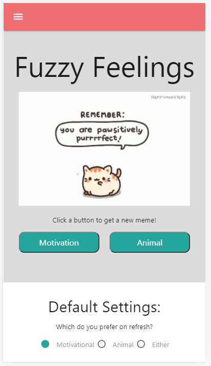
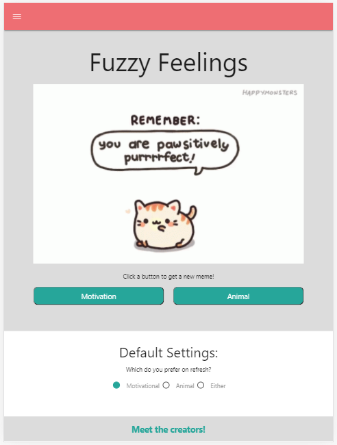
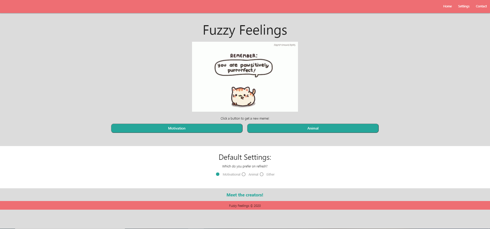

# fuzzy_feelings
Generate images of cute animals for inspiration

## Description
Fuzzy Feelings is an application that generates images of motivational memes and/or animal memes depending on the users choice. It is a FUN application designed to uplift the user according to their preferences. 

## Links

- Repository: https://github.com/penguinorange/fuzzy_feelings.git

- Deployed Application: https://penguinorange.github.io/fuzzy_feelings/

## Resources
- Materialize 
- Giphy
- Tenor
- FontSpace
- Transfonter
- HTML, CSS, JS, jQuery

## Screenshots

### Mobile-first:

### iPad:

### Browser:

## Credits
- Casey Morgan
- John Clifford
- Raymond Gordon
- Ryan Garza
